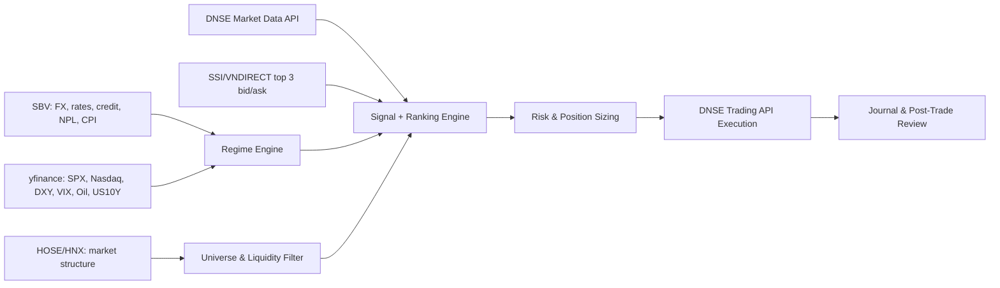

# <span style="color:#0f766e">Playbook Đầu Tư Chứng Khoán Việt Nam</span>
## <span style="color:#2563eb">Bản FACT/[GUESS] tách lớp dữ kiện, chiến lược và thực thi</span>

> Ngày biên soạn: 2026-05-31
>
> Mục tiêu: xây một playbook đầu tư và swing trading cho thị trường cổ phiếu Việt Nam theo từng regime, dựa trên dữ liệu xác thực từ nguồn chính thức và tài liệu broker/API; mọi suy luận chiến lược không xác minh trực tiếp đều được gắn `[GUESS]`.

---

## <span style="color:#7c3aed">0. Quy ước độ tin cậy</span>

| Nhãn | Ý nghĩa | Cách hiểu đúng |
|---|---|---|
| <span style="color:#0f766e"><strong>FACT</strong></span> | Đã xác minh trực tiếp từ nguồn công khai đáng tin | Có thể dùng làm nền tảng vận hành |
| <span style="color:#b45309"><strong>[GUESS]</strong></span> | Mô hình hóa, ngưỡng, trọng số, diễn giải, hoặc suy luận không có xác nhận định lượng trực tiếp | Chỉ dùng sau khi backtest/paper trade |
| <span style="color:#2563eb"><strong>RULE</strong></span> | Quy tắc vận hành được đề xuất | Là playbook hành động, không phải chân lý |
| <span style="color:#b91c1c"><strong>AVOID</strong></span> | Điều cần tránh | Dùng để giảm drawdown và lỗi thực thi |

### Ghi chú phương pháp
- Chỉ những dữ kiện trích được trực tiếp từ HOSE, HNX, SBV, SSI, VNDIRECT, DNSE, tài liệu `yfinance` mới được giữ là `FACT`.
- Toàn bộ framework chiến lược, trọng số điểm, ngưỡng MA/RS/ATR, tỷ trọng vốn, quy tắc entry/exit bên dưới mặc định là `[GUESS]`, trừ khi có gắn `FACT` riêng.
- Tài liệu này không tuyên bố “chính xác tuyệt đối” cho mọi điểm chiến lược. Phần nào không thể xác minh trực tiếp bằng nguồn đáng tin sẽ giữ nguyên nhãn `[GUESS]`.

---

## <span style="color:#7c3aed">1. Ma trận nguồn dữ liệu xác thực</span>

| Nguồn | Loại nguồn | Dữ kiện xác minh được | Mức dùng phù hợp |
|---|---|---|---|
| HOSE | Sở giao dịch chính thức | Vốn hóa, GTGD bình quân, số mã niêm yết, data feed | Thanh khoản cấu trúc, bối cảnh thị trường |
| HNX | Sở giao dịch chính thức | GTGD HNX/UPCoM/phái sinh, trạng thái thị trường | So sánh thanh khoản ngoài HOSE, hedge context |
| SBV | Cơ quan quản lý tiền tệ | Tỷ giá trung tâm, lãi suất NHNN, lãi suất liên ngân hàng, M2/tiền gửi, tín dụng, NPL, CPI | Regime macro |
| SSI iBoard | Bảng điện broker lớn | Top 3 bid/ask, quote realtime, chỉ số, GTGD, KLGD | Quan sát top-of-book và breadth thị trường |
| SSI iBoard Pro | Nền tảng giao dịch broker | Theo dõi thị trường/cổ phiếu và giao dịch cơ sở/phái sinh | Manual execution, monitoring |
| VNDIRECT DGO/DSTOCK/DBOARD | Nền tảng broker lớn | Top 3 bid/ask, GTD, 24/7, lệnh điều kiện, odd-lot | Manual execution và xác minh thực tiễn retail |
| DNSE LightSpeed API | API broker | `Trading API`, `Market Data API`, realtime account/order, realtime market data | Automation và rule-based execution |
| yfinance | Thư viện research | Market/history/news/WebSocket/search/sector, nhưng không phải nguồn chính thức | Research và overlay liên thị trường |

---

## <span style="color:#7c3aed">2. Bằng chứng FACT đã chốt từ nguồn công khai</span>

### 2.1. Cấu trúc thanh khoản thị trường

| Dữ kiện | Trích xuất xác thực | Ý nghĩa |
|---|---|---|
| <span style="color:#0f766e"><strong>FACT</strong></span> HOSE | Trang chủ HOSE hiển thị `Giá trị vốn hóa 8,782,205.36 tỷ VND`, `GTGD trung bình 28,683.99 tỷ VND`, `657 mã CK niêm yết` | HOSE là trung tâm thanh khoản lớn nhất trong cụm nguồn khảo sát |
| <span style="color:#0f766e"><strong>FACT</strong></span> HNX/UPCoM/phái sinh | HNX hiển thị `Cổ phiếu niêm yết 880.03 tỷ`, `UPCoM 427.68 tỷ`, `HĐTL chỉ số cổ phiếu 41,872.84 tỷ`, cập nhật ngày `29/05/2026` | HNX/UPCoM có thanh khoản nhỏ hơn HOSE; phái sinh đủ lớn để dùng làm lớp hedge context |

### 2.2. Nguồn macro và biến phải theo dõi

| Dữ kiện | Trích xuất xác thực | Ý nghĩa |
|---|---|---|
| <span style="color:#0f766e"><strong>FACT</strong></span> SBV công khai tỷ giá và lãi suất | SBV có mục `Tỷ giá trung tâm`, `Lãi suất NHNN quy định`, `Lãi suất thị trường liên ngân hàng` | Regime ở Việt Nam phải gắn với thanh khoản tiền tệ và áp lực FX |
| <span style="color:#0f766e"><strong>FACT</strong></span> SBV công khai tín dụng và chất lượng hệ thống | SBV có mục `Tổng phương tiện thanh toán và Tiền gửi`, `Dư nợ tín dụng đối với nền kinh tế`, `Tỷ lệ nợ xấu trong tổng dư nợ tín dụng`, `CPI` | Có thể dựng macro regime từ dữ liệu trong nước thay vì chỉ nhìn chart index |

### 2.3. Những gì retail thật sự nhìn thấy trên order book

| Dữ kiện | Trích xuất xác thực | Ý nghĩa |
|---|---|---|
| <span style="color:#0f766e"><strong>FACT</strong></span> SSI iBoard hiển thị top-of-book | Trang iBoard hiển thị rõ `Bên mua`, `Khớp lệnh`, `Bên bán`, `Giá 3/KL3`, `Giá 2/KL2`, `Giá 1/KL1` | Nhà đầu tư retail thường ra quyết định với top 3 mức giá, không phải full-depth institutional order flow |
| <span style="color:#0f766e"><strong>FACT</strong></span> VNDIRECT cũng hiển thị top 3 giá | Hướng dẫn VNDIRECT nêu rõ màn hình đặt lệnh có `Giá trần/tham chiếu/sàn`, `3 bước giá và khối lượng giá bán tốt nhất`, `3 bước giá và khối lượng mua tốt nhất` | Top-of-book là cấu trúc chung đủ để làm lớp xác nhận timing, không nên coi là nguồn alpha chính |

### 2.4. Odd-lot và thực thi lệnh

| Dữ kiện | Trích xuất xác thực | Ý nghĩa |
|---|---|---|
| <span style="color:#0f766e"><strong>FACT</strong></span> VNDIRECT odd-lot | Bài `Giao dịch lô lẻ tại VNDIRECT` xác nhận odd-lot là `từ 1 đến 99 chứng khoán` | Có thể xác minh rõ tồn tại odd-lot và dải khối lượng odd-lot |
| <span style="color:#0f766e"><strong>FACT</strong></span> Lệnh odd-lot bị giới hạn | Odd-lot `không hỗ trợ MTL, ATO, ATC`; chỉ khớp với `lệnh lô lẻ đối ứng` | Không nên giả định odd-lot có cùng chất lượng execution như lô chẵn |
| <span style="color:#0f766e"><strong>FACT</strong></span> Khung giờ odd-lot | VNDIRECT nêu giao dịch lô lẻ có thể diễn ra trong `khớp định kỳ`, `khớp liên tục`, và `thỏa thuận` theo khung giờ được nêu trong bài | Odd-lot là cơ chế có thật, nhưng không phải lớp execution lý tưởng cho chiến lược quy mô lớn |

### 2.5. Khả năng code hóa và API

| Dữ kiện | Trích xuất xác thực | Ý nghĩa |
|---|---|---|
| <span style="color:#0f766e"><strong>FACT</strong></span> DNSE có Trading API | DNSE LightSpeed API ghi rõ `Trading API` hỗ trợ realtime thông tin tài sản, trạng thái tài khoản và sổ lệnh giao dịch | Có thể code hóa vòng lặp tín hiệu -> sizing -> đặt/hủy lệnh |
| <span style="color:#0f766e"><strong>FACT</strong></span> DNSE có Market Data API | DNSE ghi rõ `Market Data API` trả dữ liệu realtime theo biến động thị trường, đầy đủ dữ liệu mã và chỉ số | Có thể xây engine quét tín hiệu hằng ngày và intraday |

### 2.6. Giới hạn pháp lý và vai trò của yfinance

| Dữ kiện | Trích xuất xác thực | Ý nghĩa |
|---|---|---|
| <span style="color:#0f766e"><strong>FACT</strong></span> `yfinance` không phải nguồn chính thức | Tài liệu `yfinance` ghi rõ: không liên kết, không được Yahoo xác nhận, dùng `research and educational purposes`, `personal use only` | Không dùng `yfinance` làm nguồn quyết định execution cho cổ phiếu Việt Nam |
| <span style="color:#0f766e"><strong>FACT</strong></span> `yfinance` có module research hữu ích | Tài liệu liệt kê `Ticker`, `download`, `Market`, `WebSocket`, `Search`, `Sector`, `Industry`, `Screener` | Phù hợp để overlay bối cảnh quốc tế, không phù hợp làm order-book source nội địa |

---

## <span style="color:#7c3aed">3. Những gì có thể kết luận chắc và những gì chưa nên khẳng định</span>

### 3.1. Kết luận chắc
- <span style="color:#0f766e"><strong>FACT</strong></span> Nhà đầu tư retail tại Việt Nam có thể quan sát top-of-book 3 mức giá từ SSI/VNDIRECT.
- <span style="color:#0f766e"><strong>FACT</strong></span> DNSE có bề mặt API đủ để xây một chiến lược swing có quét tín hiệu và execution tự động.
- <span style="color:#0f766e"><strong>FACT</strong></span> SBV cung cấp đủ biến vĩ mô trong nước để dựng macro regime thay vì chỉ nhìn VNIndex.
- <span style="color:#0f766e"><strong>FACT</strong></span> `yfinance` phù hợp cho lớp overlay liên thị trường và research, không phải nguồn dữ liệu giao dịch chính thức của Việt Nam.

### 3.2. Những điểm chưa nên khẳng định quá tay
- <span style="color:#b45309"><strong>[GUESS]</strong></span> “Order book top 3 đủ để tạo alpha chính” là kết luận yếu. Top 3 phù hợp hơn như lớp xác nhận timing.
- <span style="color:#b45309"><strong>[GUESS]</strong></span> “Một công thức RS leader là đúng cho mọi chu kỳ” là kết luận yếu. Trọng số phải được backtest.
- <span style="color:#b45309"><strong>[GUESS]</strong></span> “Một bộ stop cố định cho mọi cổ phiếu” là sai trong thực chiến. Stop phải gắn với cấu trúc giá và thanh khoản.
- <span style="color:#b45309"><strong>[GUESS]</strong></span> Các mức phổ biến như `lô chẵn 100`, `biên độ HOSE/HNX/UPCoM`, `tick-size cụ thể` rất nhiều khả năng là đúng theo thực hành thị trường, nhưng trong tài liệu này vẫn không nâng lên `FACT` nếu không trích được nguyên văn từ nguồn đã fetch trong phiên này.

---

## <span style="color:#7c3aed">4. Kiến trúc dữ liệu khuyến nghị</span>

> Từ đây trở xuống, trừ khi có nhãn `FACT` riêng, mọi mô hình và ngưỡng đều là `[GUESS]`.



### <span style="color:#2563eb">RULE</span> Phân vai dữ liệu
- `SBV`: lớp macro nội địa.
- `yfinance`: lớp macro/liên thị trường quốc tế.
- `DNSE Market Data API`: dữ liệu đầu vào chính cho machine-readable scanner.
- `SSI/VNDIRECT`: lớp quan sát top-of-book và kiểm tra thực thi thủ công.
- `DNSE Trading API`: lớp execution.

### <span style="color:#b91c1c">AVOID</span>
- Dùng `yfinance` như source chính để vào/ra lệnh cổ phiếu Việt Nam.
- Dùng top 3 bid/ask như thể đó là full-depth order flow.
- Dùng dữ liệu broker marketing page để suy ra alpha mà không qua backtest.

---

## <span style="color:#7c3aed">5. [GUESS] Playbook theo regime: bull, sideways, bear</span>

### 5.1. Bộ nhận diện regime

| Regime | Bộ lọc nhận diện đề xuất | Tư thế danh mục |
|---|---|---|
| Bull | VNIndex > MA20 > MA50; breadth 10 phiên dương; nhóm leader đồng thuận; FX và lãi suất liên ngân hàng không có tín hiệu stress lớn | Tấn công có chọn lọc |
| Sideways | VNIndex dao động quanh MA20/MA50; breadth trung tính; ít nhóm ngành dẫn dắt rõ; thị trường quay vòng nhanh | Đánh ngắn, chốt nhanh |
| Bear | VNIndex < MA50; breadth xấu; nhiều breakout fail; FX/interbank xấu đi; nhóm leader không duy trì được sức mạnh | Phòng thủ, giảm beta |

### 5.2. Bull regime
- <span style="color:#2563eb"><strong>RULE</strong></span> Ưu tiên `breakout leader`, `first pullback`, `add-on sau xác nhận`.
- <span style="color:#2563eb"><strong>RULE</strong></span> Tỷ trọng cổ phiếu: `70%-100% NAV` tùy mức đồng thuận của breadth.
- <span style="color:#2563eb"><strong>RULE</strong></span> Margin: chỉ mở khi đã có chuỗi tín hiệu đúng và portfolio đang đi thuận.
- <span style="color:#b91c1c"><strong>AVOID</strong></span> Mua cổ phiếu yếu chỉ vì “ngành đang nóng”.

### 5.3. Sideways regime
- <span style="color:#2563eb"><strong>RULE</strong></span> Chỉ ưu tiên mã `khỏe hơn thị trường` hoặc có catalyst riêng.
- <span style="color:#2563eb"><strong>RULE</strong></span> Tỷ trọng cổ phiếu: `35%-60% NAV`.
- <span style="color:#2563eb"><strong>RULE</strong></span> Chốt lời nhanh hơn bull market; ít giữ full-size qua nhiều phiên nếu chưa có follow-through.
- <span style="color:#b91c1c"><strong>AVOID</strong></span> Chase breakout xa pivot.

### 5.4. Bear regime
- <span style="color:#2563eb"><strong>RULE</strong></span> Tỷ trọng cổ phiếu: `0%-30% NAV`; ưu tiên tiền mặt.
- <span style="color:#2563eb"><strong>RULE</strong></span> Long chỉ dành cho `RS leader` rất mạnh hoặc có catalyst riêng.
- <span style="color:#2563eb"><strong>RULE</strong></span> Không dùng margin.
- <span style="color:#2563eb"><strong>RULE</strong></span> Nếu có năng lực phái sinh, dùng VN30 futures như lớp hedge thay vì cố gồng long equity.
- <span style="color:#b91c1c"><strong>AVOID</strong></span> Bắt đáy hàng loạt, average down, hoặc gom penny/illiquid chỉ vì “rẻ”.

---

## <span style="color:#7c3aed">6. [GUESS] Bộ tiêu chí chọn cổ phiếu theo phong cách</span>

### 6.1. Growth

| Tiêu chí | Mức đề xuất |
|---|---|
| Tăng trưởng doanh thu YoY | > 15% |
| Tăng trưởng LNST YoY | > 20% |
| ROE | > 15% |
| OCF | Dương và không kém xa lợi nhuận kế toán |
| Bảng cân đối | Không có áp lực nợ/vốn hóa quá mạnh |
| Price action | Gần đỉnh 52 tuần, RS dương so với VNIndex |
| Catalyst | KQKD, backlog, mở room, chu kỳ ngành, dự án |

### 6.2. Value

| Tiêu chí | Mức đề xuất |
|---|---|
| Định giá | P/E hoặc P/B thấp hơn median lịch sử của chính doanh nghiệp hoặc thấp hơn ngành |
| Chất lượng tài sản | Không có red flag lớn về phải thu, tồn kho, trái phiếu, nợ xấu |
| Dòng tiền | Không lệch quá lớn giữa lợi nhuận và OCF trong nhiều kỳ |
| Catalyst mở khóa giá trị | Thoái vốn, pháp lý, tài sản, hồi phục chu kỳ |
| Thanh khoản | Đủ lớn để vào/ra không méo giá |

### 6.3. Dividend

| Tiêu chí | Mức đề xuất |
|---|---|
| Dividend yield | > 6% |
| Lịch sử cổ tức | Tối thiểu 3 năm ổn định, ưu tiên tiền mặt |
| Payout quality | Chi trả không vượt xa OCF thực tế |
| Đòn bẩy | Không phụ thuộc nợ ngắn hạn cao |
| Sector fit | Điện, nước, cảng, hạ tầng, tiện ích hoặc doanh nghiệp mature |

### 6.4. Swing

| Tiêu chí | Mức đề xuất |
|---|---|
| GTGD bình quân 20 phiên | > 20-50 tỷ VND/ngày |
| Xu hướng | Giá > MA20; tốt hơn nếu MA20 > MA50 |
| Cấu trúc nền | 15-40 phiên tích lũy, biên co hẹp dần |
| Volume | Co cạn trong nền, nổ khi breakout |
| RS | Nằm trong nhóm mạnh hơn thị trường |
| Order book | Không có sell wall refresh liên tục ở pivot |
| Rủi ro | Không vướng cảnh báo/hạn chế giao dịch nếu có dữ liệu |

---

## <span style="color:#7c3aed">7. [GUESS] Framework quản trị vốn và điểm mua/bán</span>

### 7.1. Risk budget theo regime

| Regime | Risk mỗi lệnh | Số vị thế tối đa | Tỷ trọng tối đa mỗi mã | Tỷ trọng tối đa mỗi ngành |
|---|---:|---:|---:|---:|
| Bull | 0.75%-1.00% NAV | 6-8 | 15%-20% | 30%-35% |
| Sideways | 0.40%-0.60% NAV | 4-6 | 10%-15% | 25%-30% |
| Bear | 0.25%-0.40% NAV | 1-3 | 5%-10% | 15%-20% |

### 7.2. Công thức sizing

```text
risk_budget_vnd = NAV * risk_per_trade_pct
stop_distance_pct = (entry_price - stop_price) / entry_price
position_value_vnd = min(max_alloc_pct * NAV, risk_budget_vnd / stop_distance_pct)
```

### 7.3. Điểm mua đề xuất

#### A. Breakout entry
- Giá vượt pivot hoặc đỉnh nền.
- Volume phiên xác nhận >= `1.5x` trung bình 20 phiên.
- Giá đóng cửa nằm ở nửa trên biên độ ngày.
- RSL và sector score vẫn nằm trong vùng mạnh.

#### B. First pullback entry
- Breakout trước đó là breakout thành công.
- Pullback đầu tiên về EMA10/EMA20 hoặc kiểm định pivot cũ.
- Volume pullback thấp hơn volume breakout.
- Bid top 3 không gãy rõ khi thị trường rung.

#### C. Pocket pivot / pivot nội bộ
- Giá đã nằm trên MA20/MA50.
- Có phiên tăng đủ mạnh với volume tốt hơn các phiên giảm gần nhất.
- Dùng khi thị trường chưa đủ khỏe cho breakout rộng.

### 7.4. Stop loss đề xuất
- Dưới pivot một khoảng an toàn nhỏ.
- Hoặc dưới đáy pullback gần nhất.
- Hoặc theo `1.5 ATR`; chọn mức nào bảo vệ cấu trúc tốt hơn nhưng không quá rộng.

### 7.5. Take profit đề xuất
- Chốt `25%-33%` ở `1.5R`.
- Chốt tiếp `25%-33%` ở `2R`.
- Phần còn lại trail theo EMA10, đáy swing, hoặc phân phối lớn.

### 7.6. Time stop
- Nếu sau `5-8` phiên không có follow-through, giảm hoặc thoát vị thế.
- Nếu breakout quay trở lại nền và đóng dưới pivot, thoát nhanh.

### 7.7. Kỷ luật bắt buộc
- <span style="color:#b91c1c"><strong>AVOID</strong></span> Average down.
- <span style="color:#b91c1c"><strong>AVOID</strong></span> Full margin ngoài bull regime rõ.
- <span style="color:#b91c1c"><strong>AVOID</strong></span> Quá tải một ngành beta cao.

---

## <span style="color:#7c3aed">8. [GUESS] Checklist swing trading Việt Nam</span>

### 8.1. Trước phiên
- [ ] Cập nhật regime: VNIndex so với MA20/MA50, breadth 5-10 phiên, nhóm dẫn dắt còn đồng thuận không.
- [ ] Cập nhật macro trong nước từ SBV: tỷ giá, lãi suất, tín dụng, dấu hiệu căng thanh khoản.
- [ ] Cập nhật macro ngoài nước từ `yfinance`: SPX, Nasdaq, DXY, VIX, dầu, US10Y.
- [ ] Làm watchlist 3 lớp: breakout, first pullback, catalyst riêng.
- [ ] Xác định sẵn `entry`, `stop`, `max size`, `invalid condition` cho từng mã.

### 8.2. Trong phiên
- [ ] Không vội chase trong vài phút đầu nếu chưa có xác nhận.
- [ ] Theo dõi đồng thời: VNIndex, VN30, nhóm ngành dẫn dắt, mã mục tiêu.
- [ ] Kiểm tra xem mã có giữ tốt hơn thị trường khi thị trường rung hay không.
- [ ] Quan sát top 3 bid/ask: có hấp thụ cung hay bị đè lệnh lặp lại.
- [ ] Chỉ vào lệnh khi đúng setup; không mua vì bảng điện xanh.
- [ ] Nếu giá đi quá xa pivot > `3%-5%`, bỏ qua hoặc giảm size mạnh.

### 8.3. Sau phiên
- [ ] Đánh dấu breakout nào thật sự thành công và breakout nào fail.
- [ ] Nâng stop ở các vị thế đúng hướng.
- [ ] Cập nhật nhật ký giao dịch: lý do vào/ra, có tuân thủ rule không.
- [ ] Loại bỏ mã yếu khỏi watchlist, giữ lại RS leader đang tích lũy đẹp.
- [ ] Chuẩn bị kịch bản cho phiên hôm sau thay vì phản ứng ngẫu hứng.

---

## <span style="color:#7c3aed">9. [GUESS] Chiến lược swing rule-based với DNSE API + yfinance</span>

### 9.1. Mục tiêu
- `DNSE API`: nguồn dữ liệu machine-readable trong nước + execution.
- `yfinance`: overlay quốc tế và tâm lý risk-on/risk-off.
- `SSI/VNDIRECT`: lớp đối chiếu discretionary nếu trader muốn kiểm tra thêm book/market tape.

### 9.2. Data map thực thi

| Lớp | Nguồn | Dữ liệu dùng |
|---|---|---|
| Global overlay | yfinance | SPX, Nasdaq, DXY, VIX, Oil, US10Y |
| Domestic macro | SBV | FX, policy rates, interbank rates, M2, credit, NPL, CPI |
| Domestic market | DNSE Market Data API | Index, OHLCV, realtime quote, top bid/ask, GTGD/KLGD |
| Manual confirmation | SSI/VNDIRECT | Top 3 bid/ask, bảng điện, trạng thái nhóm ngành |
| Execution | DNSE Trading API | account, buying power, create order, cancel order, order status |

### 9.3. Universe filter

```text
- Chỉ giữ mã có GTGD bình quân 20 ngày > 20 tỷ VND
- Giá > 10,000 VND
- Tránh mã có spread rộng bất thường hoặc illiquid
- Ưu tiên HOSE; HNX chọn lọc; UPCoM chỉ dùng nếu thanh khoản và spread đủ tốt
```

### 9.4. Regime filter

```python
# [GUESS]

bull_regime = (
    vnindex_close > vnindex_ma50 and
    vnindex_ma20 > vnindex_ma50 and
    breadth_10d > 1.05 and
    dxy_5d_return < 0.015 and
    us10y_5d_change_bp < 20
)

sideways_regime = (
    abs(vnindex_close / vnindex_ma20 - 1) < 0.03 and
    0.90 <= breadth_10d <= 1.10
)

bear_regime = (
    vnindex_close < vnindex_ma50 and
    breadth_10d < 0.95
)
```

### 9.5. Setup filter

```python
# [GUESS]

candidate = (
    close > ma20 and
    ma20 >= ma50 and
    rs_leader_score >= 70 and
    sector_score >= 60 and
    base_days >= 15 and
    distance_to_52w_high <= 0.15 and
    avg_value_20d >= 20e9
)
```

### 9.6. Entry rules

```python
# [GUESS] breakout

entry_breakout = (
    candidate and
    last_price >= pivot * 1.003 and
    volume_today >= 1.5 * avg_volume_20d and
    close_position_in_range >= 0.70 and
    top3_ask_refresh_flag is False and
    book_imbalance_top3 > -0.10
)
```

```python
# [GUESS] first pullback

entry_pullback = (
    prior_breakout_success and
    last_price >= ema20 and
    retrace_from_high <= 0.04 and
    pullback_volume_ratio <= 0.80 and
    rs_leader_score >= 70
)
```

### 9.7. Stop, take profit, time stop

```python
# [GUESS]

stop_price = min(
    pivot * 0.985,
    recent_swing_low,
    entry_price - 1.5 * atr
)

if pnl_r >= 1.5:
    sell_partial(0.25)

if pnl_r >= 2.0:
    sell_partial(0.25)

if close < ema10 or close < recent_swing_low:
    exit_remaining()

if holding_days >= 5 and max_unrealized_r < 1.0:
    reduce_or_exit()
```

### 9.8. Position sizing

```python
# [GUESS]

risk_pct = 0.01 if bull_regime else 0.005 if sideways_regime else 0.003
max_alloc = 0.20 if bull_regime else 0.12 if sideways_regime else 0.08

risk_budget = nav * risk_pct
stop_pct = (entry_price - stop_price) / entry_price
position_value = min(nav * max_alloc, risk_budget / stop_pct)
```

### 9.9. Triết lý chiến lược
- <span style="color:#2563eb"><strong>RULE</strong></span> Order book chỉ là `timing filter`, không phải nguồn alpha chính.
- <span style="color:#2563eb"><strong>RULE</strong></span> Alpha chính đến từ `regime + relative strength + setup quality + risk control`.
- <span style="color:#b91c1c"><strong>AVOID</strong></span> Không tự động hóa hoàn toàn nếu chưa kiểm tra chất lượng fill, trượt giá và trạng thái API trong thực tế.

---

## <span style="color:#7c3aed">10. [GUESS] Template chấm điểm cổ phiếu swing theo [trend + sector + order book + risk]</span>

### 10.1. Công thức tổng quát

```text
SwingScore = 0.35 * TrendScore
           + 0.20 * SectorScore
           + 0.15 * OrderBookScore
           + 0.15 * LiquidityVolumeScore
           + 0.15 * (100 - RiskPenalty)
```

### 10.2. Thành phần điểm

| Thành phần | Tiêu chí | Điểm tối đa |
|---|---|---:|
| TrendScore | Giá > MA20, Giá > MA50, MA20 dốc lên, gần đỉnh 52w, RS dương | 35 |
| SectorScore | Ngành nằm top strength, breadth ngành tốt, có catalyst | 20 |
| OrderBookScore | Bid top 3 tốt, không có sell wall refresh, giữ tốt gần high-of-day | 15 |
| LiquidityVolumeScore | GTGD đủ lớn, volume co trong nền, volume nổ lúc breakout | 15 |
| RiskPenalty | Thanh khoản mỏng, event risk, red flag quản trị/tài chính | 15 |

### 10.3. Ngưỡng dùng

| Điểm | Hành động |
|---|---|
| >= 75 | Ứng viên swing mạnh |
| 65-74 | Watchlist/chờ điểm vào đẹp |
| < 65 | Loại |

---

## <span style="color:#7c3aed">11. [GUESS] Checklist scan ra đúng các mã khỏe hơn thị trường</span>

### 11.1. Scan định lượng
- [ ] `ret_20_stock - ret_20_vnindex > 0`
- [ ] `ret_60_stock - ret_60_vnindex > 0`
- [ ] Giá > MA20 và tốt hơn nếu > MA50
- [ ] Khoảng cách tới đỉnh 52 tuần <= `15%`
- [ ] GTGD bình quân 20 phiên đạt chuẩn thanh khoản
- [ ] Tỷ lệ volume ngày tăng / volume ngày giảm > `1`
- [ ] Khi VNIndex giảm mạnh, mã giảm ít hơn hoặc vẫn giữ nền tốt

### 11.2. Scan định tính
- [ ] Có catalyst riêng hoặc ít nhất có narrative đủ rõ.
- [ ] Không phải tăng vì cung mỏng/đội lái nhỏ.
- [ ] Không có red flag lớn về công bố thông tin, pháp lý, hoặc cấu trúc tài chính.
- [ ] Có dấu hiệu tổ chức hoặc dòng tiền lớn duy trì trong nhiều phiên.

### 11.3. Scan intraday xác nhận
- [ ] Top 3 bid hấp thụ tốt khi thị trường rung.
- [ ] Giá không bị bán trả ngược mạnh khi chạm pivot.
- [ ] Khối lượng khớp thật tăng, không chỉ là lệnh treo.
- [ ] Giá đóng gần đỉnh phiên hoặc ít nhất nằm nửa trên biên độ ngày.

---

## <span style="color:#7c3aed">12. [GUESS] Công thức chấm điểm relative strength leader hằng ngày</span>

### 12.1. Input cần có
- Dữ liệu giá/khối lượng cổ phiếu từ DNSE hoặc SSI.
- Dữ liệu VNIndex để làm benchmark.
- Top 3 bid/ask để bổ sung lớp timing.
- `yfinance` chỉ dùng cho overlay risk-on/risk-off toàn cục, không bắt buộc trong điểm RSL lõi.

### 12.2. Biến thành phần

```text
stock_ret_20 = close / close_20d_ago - 1
mkt_ret_20   = vnindex / vnindex_20d_ago - 1
stock_ret_60 = close / close_60d_ago - 1
mkt_ret_60   = vnindex / vnindex_60d_ago - 1

excess_20 = stock_ret_20 - mkt_ret_20
excess_60 = stock_ret_60 - mkt_ret_60

drawdown_20_stock = 1 - close / max(close[-20:])
drawdown_20_mkt   = 1 - vnindex / max(vnindex[-20:])

distance_to_high_252 = 1 - close / max(close[-252:])

up_down_vol_ratio = avg_up_volume_20 / max(avg_down_volume_20, epsilon)

top3_bid_value = sum(bid_i * bid_vol_i for i in 1..3)
top3_ask_value = sum(ask_i * ask_vol_i for i in 1..3)
book_imbalance = (top3_bid_value - top3_ask_value) / max(top3_bid_value + top3_ask_value, epsilon)
```

### 12.3. Chuẩn hóa điểm

```text
S1 = clip(50 + 400 * excess_20, 0, 100)
S2 = clip(50 + 250 * excess_60, 0, 100)
S3 = clip(50 + 500 * (drawdown_20_mkt - drawdown_20_stock), 0, 100)
S4 = clip(50 + 300 * (close / ma50 - 1), 0, 100)
S5 = clip(100 - 400 * distance_to_high_252, 0, 100)
S6 = clip(50 + 20 * (up_down_vol_ratio - 1), 0, 100)
S7 = clip(50 + 50 * book_imbalance, 0, 100)
S8 = SectorScore
```

### 12.4. Điểm RSL cuối cùng

```text
RSL = 0.22*S1 + 0.18*S2 + 0.15*S3 + 0.15*S4 + 0.10*S5 + 0.08*S6 + 0.07*S7 + 0.05*S8
```

### 12.5. Ngưỡng hành động

| RSL | Diễn giải |
|---|---|
| >= 75 | Relative strength leader mạnh |
| 68-74 | Watchlist tốt |
| 60-67 | Có thể theo dõi nhưng chưa mạnh |
| < 60 | Loại |

### 12.6. Cách dùng đúng
- Dùng RSL để `xếp hạng`, không dùng một mình để `mua`.
- Sau khi lọc RSL cao, kiểm tra lại `setup`, `sector`, `liquidity`, `order book`, `event risk`.
- Nếu thị trường đang bear regime, tăng ngưỡng RSL tối thiểu và giảm size.

---

## <span style="color:#7c3aed">13. Phản biện chiến lược và các bẫy phổ biến</span>

### 13.1. Vì sao không nên lấy order book làm alpha chính
- Top 3 bid/ask chỉ phản ánh bề mặt thanh khoản ngay trước mắt.
- Có thể xuất hiện lệnh treo, lệnh hủy nhanh, hoặc làm đẹp bảng điện.
- Order book mạnh nhất khi dùng như `confirm` cho setup đã tốt từ chart/RS/sector/regime.

### 13.2. Vì sao không nên lấy yfinance làm nguồn giao dịch chính cho Việt Nam
- `yfinance` tự ghi rõ không phải nguồn chính thức, chỉ phù hợp research/education/personal use.
- Với cổ phiếu Việt Nam, độ trễ, độ phủ, và quyền sử dụng không phù hợp để làm execution-grade feed.

### 13.3. Vì sao bull/sideways/bear phải dùng khung khác nhau
- Cùng một setup nhưng kỳ vọng follow-through khác nhau theo regime.
- Chiến lược thắng lớn ở bull market có thể cho tỷ lệ fail cao ở sideways/bear.
- Tách regime giúp giảm overtrading và giảm việc áp một mẫu hành vi lên mọi giai đoạn.

---

## <span style="color:#7c3aed">14. Kết luận vận hành</span>

- <span style="color:#0f766e"><strong>FACT</strong></span> Stack dữ liệu hợp lý nhất trong phạm vi nguồn đã xác minh là:
  - `SBV` cho macro Việt Nam
  - `HOSE/HNX` cho cấu trúc thanh khoản thị trường
  - `DNSE API` cho machine-readable domestic data + execution
  - `SSI/VNDIRECT` cho quan sát top-of-book và execution retail thực tế
  - `yfinance` cho overlay quốc tế
- <span style="color:#b45309"><strong>[GUESS]</strong></span> Cách triển khai có xác suất thực dụng tốt nhất là kết hợp `regime filter + relative strength + setup quality + position sizing + order-book confirmation`.
- <span style="color:#b45309"><strong>[GUESS]</strong></span> Không có một chiến lược “đúng tuyệt đối” cho mọi pha thị trường. Cách đúng hơn là tách lớp `FACT` cho dữ liệu và giữ kỷ luật `[GUESS]` cho mô hình chiến lược.

---

## <span style="color:#7c3aed">15. Nguồn dẫn chứng</span>

### Nguồn chính thức và dữ liệu hạ tầng
1. HOSE: https://www.hsx.vn/
2. HNX: https://www.hnx.vn/vi-vn/
3. SBV: https://www.sbv.gov.vn/

### Nguồn broker, bảng điện và API
4. SSI iBoard: https://iboard.ssi.com.vn/
5. SSI iBoard Pro: https://www.ssi.com.vn/khach-hang-ca-nhan/nen-tang-giao-dich/nen-tang-mobile-trading/iboard-pro
6. SSI Cổ phiếu FAQ: https://www.ssi.com.vn/khach-hang-ca-nhan/co-phieu-faq
7. SSI KRX thị trường cơ sở FAQ: https://www.ssi.com.vn/khach-hang-ca-nhan/krx-thi-truong-co-so-faq
8. SSI Quy định giao dịch cổ phiếu: https://www.ssi.com.vn/khach-hang-ca-nhan/quy-dinh-giao-dich/quy-dinh-giao-dich-co-phieu
9. VNDIRECT Hướng dẫn giao dịch cổ phiếu: https://support.vndirect.com.vn/hc/vi/articles/4402908551705-H%C6%AF%E1%BB%9ANG-D%E1%BA%AAN-GIAO-D%E1%BB%8ACH-C%E1%BB%94-PHI%E1%BA%BEU
10. VNDIRECT Giao dịch lô lẻ: https://support.vndirect.com.vn/hc/vi/articles/10313129594777-Giao-d%E1%BB%8Bch-l%C3%B4-l%E1%BA%BB-t%E1%BA%A1i-VNDIRECT
11. DNSE LightSpeed API: https://developers.dnse.com.vn/

### Nguồn research
12. yfinance docs: https://ranaroussi.github.io/yfinance/
13. yfinance PyPI: https://pypi.org/project/yfinance/

---

## <span style="color:#7c3aed">16. Ghi chú cuối</span>

- Nếu muốn đưa playbook này vào giao dịch thật, bước tiếp theo bắt buộc là:
  1. Chuẩn hóa dữ liệu từ DNSE/SSI theo cùng schema.
  2. Backtest tối thiểu 3 regime khác nhau.
  3. Paper trade để đo trượt giá, chất lượng fill, lỗi kết nối API.
  4. Sau đó mới tinh chỉnh trọng số `SwingScore` và `RSL`.
- Trong tài liệu này, phần nào không thể xác minh trực tiếp bằng nguồn đã fetch thì vẫn được giữ là `[GUESS]` theo đúng yêu cầu độ tin cậy.